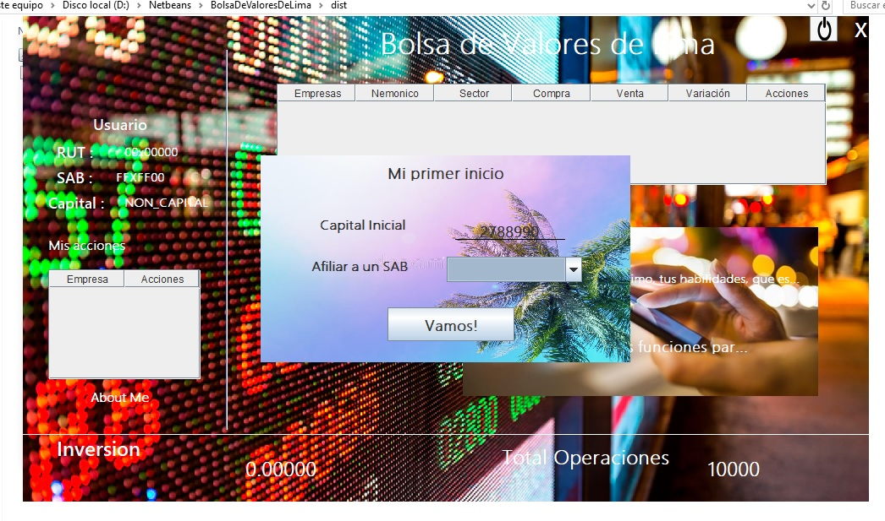

# Simulacion de la Bolsa de Valores de Lima
Proyecto 2019 II- Algoritmica IV ciclo

Puede usar el siguiente programa para  simular La bolsa de valores de lima u otras.

INSTRUCCIONES
* Cree un nuevo usuario si desea iniciar sesion
* Si ya tiene un usuario  inicie sesion y  y use el programa para invertir en la bolsa

El programa consta de las operaciones: 
* Compra
* Venta
* Informacion
* Mostrar estadisticas

SI desea añadir nuevas Empresas y/o Nuevos agentes de Bolsa:
* Inicie sesion MODO ADMINISTRADOR como : Usuario="administrador" y contraseña="administrador"  (sin comillas)
* Esto le abrira una ventana extra para agregar los datos ya mencionados

SI desea eliminar las empresas y/oSab(Agentes de Bolsa) segun deseé, elimine los archivos "dataEmpresas.dat" y/O "dataSAB.dat", segun sea lo que quiere eliminar
* Atencion: Luego de haber borrado un archivo de ellos, dispongase a agregar uno de ellos añadiendo estas entidades desde el modo administrador ya explicado anteriormente

Desarrollado por Johan Valerio Mitma- Perú- 19años

